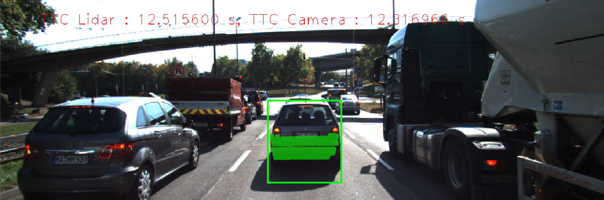

# SFND 3D Object Tracking




## Final Project Write-Up
#

### FP.0 Final Report
*Provide a Writeup / README that includes all the rubric points and how you addressed each one. You can submit your writeup as markdown or pdf.*

Here.

#
### FP.1 Match 3D Objects

*Implement the method "matchBoundingBoxes", which takes as input both the previous and the current data frames and provides as output the ids of the matched regions of interest (i.e. the boxID property). Matches must be the ones with the highest number of keypoint correspondences.*

camFusion_Student.cpp
```cpp
void matchBoundingBoxes(const DataFrame& prevFrame, const DataFrame& currFrame, const std::vector<cv::DMatch>& matches, std::map<int, int>& bbBestMatches)
{
    std::map<std::pair<int, int>, int> pointCounts;

    for (const auto& match : matches)
    {     
        // find bb ids for the previous frame keypoint
        const cv::KeyPoint& prevKeypoint = prevFrame.keypoints[match.queryIdx];
       
        std::vector<int> prevFrameBBIds;
        for (int i = 0; i < prevFrame.boundingBoxes.size(); i++)
        {
            if (prevFrame.boundingBoxes[i].roi.contains(prevKeypoint.pt))
            {
                prevFrameBBIds.push_back(i);
            }
        }

        // find bb ids for the current frame keypoint
        const cv::KeyPoint& currKeypoint = currFrame.keypoints[match.trainIdx];
     
        std::vector<int> currFrameBBIds;
        for (int i = 0; i < currFrame.boundingBoxes.size(); i++)
        {
            if (currFrame.boundingBoxes[i].roi.contains(currKeypoint.pt))
            {
                currFrameBBIds.push_back(i);
            }
        }

        // keep track of the point counts for BB matches
        for (auto prevBBId : prevFrameBBIds)
        {
            for (auto currBBId : currFrameBBIds)
            {
                auto key = std::make_pair(prevBBId, currBBId);

                if (pointCounts.count(key))
                {
                    pointCounts[key] = pointCounts[key] + 1;
                }
                else
                    pointCounts[key] = 1;
            }
        }
    }

    // finally find the best matches based on the point counts
    for (int i = 0; i < prevFrame.boundingBoxes.size(); i++)
    {
        int maxPoints       = 0;
        int currFrameBBIdx  = 0;

        for (int j = 0; j < currFrame.boundingBoxes.size(); j++)
        {
            auto key = std::make_pair(i, j);

            if (pointCounts.count(key) && 
                pointCounts[key] > maxPoints)
            {
                maxPoints = pointCounts[key];
                currFrameBBIdx = j;
            }
        }

        // store the best match
        bbBestMatches[i] = currFrameBBIdx;
    }
}
```

#
### FP.2 Compute Lidar-based TTC
*Compute the time-to-collision in second for all matched 3D objects using only Lidar measurements from the matched bounding boxes between current and previous frame.*

camFusion_Student.cpp
```cpp
void computeTTCLidar(std::vector<LidarPoint>& lidarPointsPrev, 
                     std::vector<LidarPoint>& lidarPointsCurr, double frameRate, double& TTC)
{
    // start by getting the x values of the points in both the previous and current frame
    std::vector<float> prevPointX;
    std::vector<float> currPointX;

    for (const auto& p : lidarPointsPrev)
    {
        prevPointX.push_back(p.x);
    }

    for (const auto& p : lidarPointsCurr)
    {
        currPointX.push_back(p.x);
    }

    // avoid outliers by finding the mean of the lowest 10 x values (using std::nth_element avoids full sort)
    const int samplePoints = 10;

    float prevSampleMeanX = 0.0;
    float currSampleMeanX = 0.0;

    // prev points
    if (prevPointX.size() > samplePoints)
    {
        std::vector<float>::iterator b = prevPointX.begin();
        std::vector<float>::iterator e = prevPointX.end();
        std::vector<float>::iterator s = b;

        std::advance(s, samplePoints);
        std::nth_element(b, s, e);

        prevSampleMeanX = std::accumulate(prevPointX.begin(), s, 0.0) / samplePoints;
    }
    else
    {
        prevSampleMeanX = std::accumulate(prevPointX.begin(), prevPointX.end(), 0.0) / prevPointX.size();
    }

    // curr points
    if (currPointX.size() > samplePoints)
    {
        std::vector<float>::iterator b = currPointX.begin();
        std::vector<float>::iterator e = currPointX.end();
        std::vector<float>::iterator s = b;

        std::advance(s, samplePoints);
        std::nth_element(b, s, e);

        currSampleMeanX = std::accumulate(currPointX.begin(), s, 0.0) / samplePoints;
    }
    else
    {
        currSampleMeanX = std::accumulate(currPointX.begin(), currPointX.end(), 0.0) / currPointX.size();
    }
    
  
    // finally set the TTC
    float dt = 1 / frameRate;
    TTC = currSampleMeanX * dt / (prevSampleMeanX - currSampleMeanX);
}
```


#
### FP.3 Associate Keypoint Correspondences with Bounding Boxes
*Prepare the TTC computation based on camera measurements by associating keypoint correspondences to the bounding boxes which enclose them. All matches which satisfy this condition must be added to a vector in the respective bounding box.*

camFusion_Student.cpp
```cpp
// associate a given bounding box with the keypoints it contains
void clusterKptMatchesWithROI(BoundingBox& boundingBox, std::vector<cv::KeyPoint>& kptsPrev, std::vector<cv::KeyPoint>& kptsCurr, std::vector<cv::DMatch>& kptMatches)
{
    // First get the Euclidean distances
    std::multiset<double> distances;
    for (const cv::DMatch& match : kptMatches)
    {
        const cv::KeyPoint& keypointCurr = kptsCurr[match.trainIdx];

        if (boundingBox.roi.contains(keypointCurr.pt))
        {
            const cv::KeyPoint& keypointPrev = kptsPrev[match.queryIdx];
            distances.emplace(cv::norm(keypointCurr.pt - keypointPrev.pt));
        }
    }

    // Find the mean
    const double meanEuclideanDist =
        std::accumulate(distances.begin(), distances.end(), 0.0) / distances.size();

    // Handle outliers by filtering the 10% of points that deviate furthest from the mean     
    const double filterOutliersFactor = 0.1;

    auto distancesIt = distances.crend();
    std::advance(distancesIt, round(filterOutliersFactor * distances.size()));

    double distanceFilterThreshold = *distancesIt;

    for (const cv::DMatch& match : kptMatches)
    {
        const cv::KeyPoint& keypointCurr = kptsCurr[match.trainIdx];

        if (boundingBox.roi.contains(keypointCurr.pt))
        {
            const auto& prevKpt = kptsPrev[match.queryIdx];
            const double euclideanDistance = cv::norm(keypointCurr.pt - prevKpt.pt);

            if (euclideanDistance <= distanceFilterThreshold)
            {
                boundingBox.keypoints.push_back(keypointCurr);
                boundingBox.kptMatches.push_back(match);
            }
        }
    }
}
```

#
### FP.4 Compute Camera-based TTC
*Compute the time-to-collision in second for all matched 3D objects using only keypoint correspondences from the matched bounding boxes between current and previous frame.*


```cpp
// Compute time-to-collision (TTC) based on keypoint correspondences in successive images
void computeTTCCamera(std::vector<cv::KeyPoint>& kptsPrev, 
                      std::vector<cv::KeyPoint>& kptsCurr,
                      std::vector<cv::DMatch> kptMatches, double frameRate, double& TTC, cv::Mat* visImg)
{
    // first calculate the distance ratios between all matched keypoints
    std::vector<double> distRatios; 
    double minDist = 100.0; // min. required distance

    for (const cv::DMatch& match1 : kptMatches)
    { 
        const cv::KeyPoint& currKeypoint1 = kptsCurr.at(match1.trainIdx);
        const cv::KeyPoint& prevKeypoint1 = kptsPrev.at(match1.queryIdx);

        for (const cv::DMatch& match2 : kptMatches)
        { 
            const cv::KeyPoint& currKeypoint2 = kptsCurr.at(match2.trainIdx);
            const cv::KeyPoint& prevKeypoint2 = kptsPrev.at(match2.queryIdx);

            // compute distances and distance ratios
            double currDistance = cv::norm(currKeypoint1.pt - currKeypoint2.pt);
            double prevDistance = cv::norm(prevKeypoint1.pt - prevKeypoint2.pt);

            if (currDistance >= minDist && prevDistance > 0)
            { 
                double ratio = currDistance / prevDistance;
                distRatios.push_back(ratio);
            }
        } 
    }     

    if (!distRatios.empty())
    {
        std::sort(distRatios.begin(), distRatios.end());
        long medIndex = floor(distRatios.size() / 2.0);
        // compute median dist. ratio to remove outlier influence
        double medDistRatio = distRatios.size() % 2 == 0 ?
            (distRatios[medIndex - 1] + distRatios[medIndex]) / 2.0 : distRatios[medIndex];

        // finally set the TTC
        double dt = 1 / frameRate;
        TTC = -dt / (1 - medDistRatio);
    }
    else
    {
        // we're unable to calculate TTC if the distance ratios are empty
        TTC = NAN;
    }
}

```


#
### FP.5 Performance Evaluation 1
*IFind examples where the TTC estimate of the Lidar sensor does not seem plausible. Describe your observations and provide a sound argumentation why you think this happened.*


```cpp

```

#
### FP.6 Performance Evaluation 2
*Run several detector / descriptor combinations and look at the differences in TTC estimation. Find out which methods perform best and also include several examples where camera-based TTC estimation is way off. As with Lidar, describe your observations again and also look into potential reasons.*


```cpp

```

