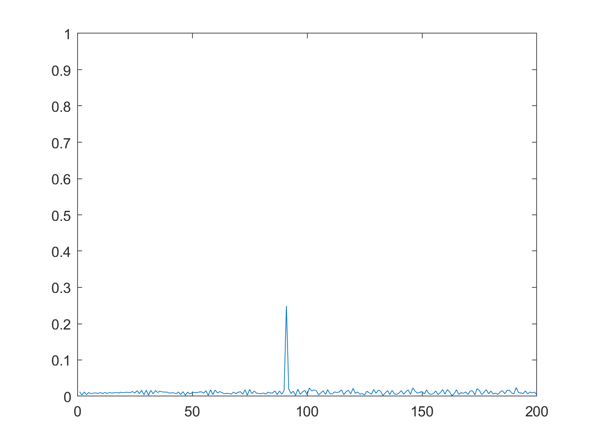
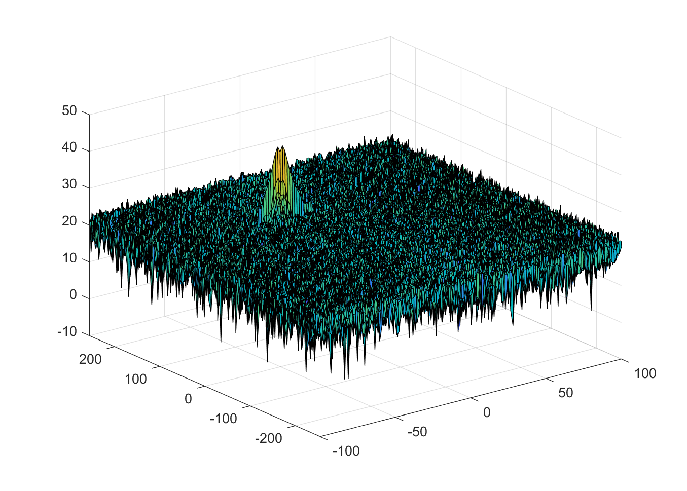
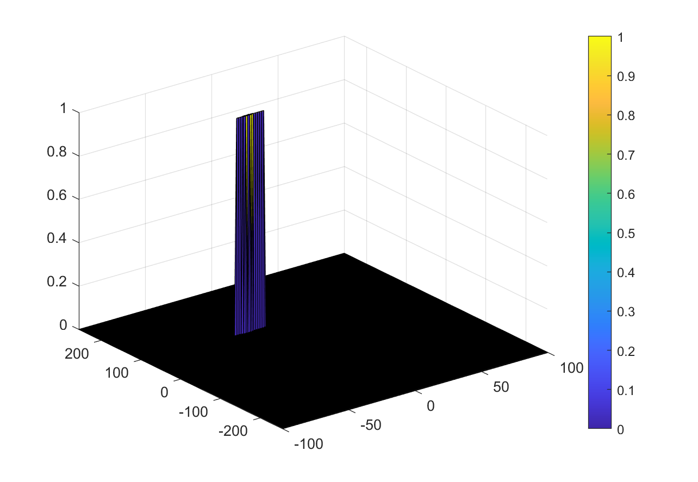

# SFND Project: Radar Target Generation and Detection

Write up for the Udacity sensor fusion radar target generation and detection project.


(image from Udacity)

#
## 1. FMCW Waveform Design
*Using the given system requirements, design
a FMCW waveform. Find its Bandwidth (B), chirp time (Tchirp) and slope of the chirp.*

### 1.1 Radar Specifications
| Specification       | Value |
|---------------------|--------|
| Frequency           | 77 GHz |
| Max Range           | 200 m  |
| Range Resolution    | 1 m    |
| Max Velocity        | 100 m/s |

### 1.2 FMCW waveform
```matlab
%% 2. FMCW Waveform Generation

% Design the FMCW waveform by giving the specs of each of its parameters.

% 2.1 Calculate the Bandwith (B)
speed_of_light = 3e8;               % speed of light [m/s]
range_res = 1;                      % radar range resolution [m]
B = speed_of_light/(2*range_res);   % Bandwidth

% 2.2 Calculate the Chirp Time (Tchirp)
max_range = 200;                            % radar maximum range [m]
Tchirp = 5.5*2*(max_range)/speed_of_light;  % chirp time [s]

% 2.3 Calculate the Slope (slope)
slope = B / Tchirp;
```

Output: slope = 2.0455e+13


#
## 2. Simulation Loop
*Simulate Target movement and calculate the beat or mixed signal for every timestamp.*

```matlab
target_initial_range = 90;    % targets initial position  [m] 
target_velocity = -25;        % targets constant velocity [m/s]
```
```matlab
%% 3. Signal generation and Moving Target simulation
% Running the radar scenario over the time. 

for i=1:length(t)         
    
    % 3.1 for each time stamp update the Range of the Target for constant velocity. 
    r_t(i) = target_initial_range + target_velocity * t(i);
    td(i)  = 2*r_t(i)/speed_of_light;
    
    % 3.2 for each time sample we need update the transmitted and received signal. 
    Tx(i) = cos(2*pi * (fc*t(i) + (slope*t(i)^2) / 2));
    Rx(i) = cos(2*pi * (fc*(t(i)-td(i)) + (slope*(t(i)-td(i))^2) / 2));
    
    % 3.3 now by mixing the Transmit and Receive generate the beat signal
    Mix(i) = Tx(i).*Rx(i);  
    
end
```

#
## 3. Range

*Implement the Range FFT on the Beat or Mixed Signal and plot the result.*

### 3.1 Range Measurement
```matlab
%% 4. Range Measurement

% 4.1 reshape the vector into Nr*Nd array. Nr and Nd here would also define the size of range and doppler FFT respectively.
Mix = reshape(Mix,[Nr,Nd]);

% 4.2 run the FFT on the beat signal along the range bins dimension (Nr) and normalize.
fftOutput = fft(Mix,Nr);
fftOutput = fftOutput./Nr;

% 4.3 take the absolute value of FFT output
fftOutputAbs = abs(fftOutput);  

% 4.4 output of FFT is double sided signal, but we are interested in only one side of the spectrum.
% Hence we throw out half of the samples.
fftOutputAbs = fftOutputAbs(1:(Nr/2));

% 4.5 plotting the range
figure('Name','Range from First FFT')
plot(fftOutputAbs);
axis ([0 200 0 1]);
```

Output: 
Peak generated at X=91, Y=0.249 which is within the +-10m tolerance of the vehicle position at 90m.


### 3.2 Range Doppler Response

```matlab
%% 5. Range Doppler Response
% The 2D FFT implementation is already provided here. This will run a 2DFFT
% on the mixed signal (beat signal) output and generate a range doppler
% map. You will implement CFAR on the generated RDM

% Range Doppler Map Generation.

% The output of the 2D FFT is an image that has reponse in the range and
% doppler FFT bins. So, it is important to convert the axis from bin sizes
% to range and doppler based on their Max values.

Mix = reshape(Mix,[Nr,Nd]);

% 2D FFT using the FFT size for both dimensions.
sig_fft2 = fft2(Mix,Nr,Nd);

% taking just one side of signal from Range dimension.
sig_fft2 = sig_fft2(1:Nr/2,1:Nd);
sig_fft2 = fftshift (sig_fft2);
RDM = abs(sig_fft2);
RDM = 10*log10(RDM) ;

% use the surf function to plot the output of 2DFFT and to show axis in both dimensions
doppler_axis = linspace(-100,100,Nd);
range_axis = linspace(-200,200,Nr/2)*((Nr/2)/400);
figure,surf(doppler_axis,range_axis,RDM);
```

Output:



#
## 4. 2D CFAR
*Implement the 2D CFAR process on the output of 2D FFT operation, i.e the Range Doppler Map.*


### 4.1 Implementation steps for the 2D CFAR process.
```matlab
%% 6. CFAR implementation
%Slide Window through the complete Range Doppler Map

% 6.1 select the number of training cells in both the dimensions.
trainingCellsRange   = 8;       
trainingCellsDoppler = 8;       

% 6.2 select the number of Guard Cells in both dimensions around the cell under test (CUT) for accurate estimation
guardCellsRange   = 2; 
guardCellsDoppler = 2; 

% 6.3 offset the threshold by SNR value in dB
offset = 5;

% 6.4 design a loop such that it slides the CUT across range doppler map by
%     giving margins at the edges for Training and Guard Cells.
%
%For every iteration sum the signal level within all the training
%cells. To sum convert the value from logarithmic to linear using db2pow
%function. Average the summed values for all of the training
%cells used. After averaging convert it back to logarithimic using pow2db.
%
%Further add the offset to it to determine the threshold. Next, compare the
%signal under CUT with this threshold. If the CUT level > threshold assign
%it a value of 1, else equate it to 0.

cellRange   = trainingCellsRange + guardCellsRange;
cellDoppler = trainingCellsDoppler + guardCellsDoppler;

noise_level = ones(2*cellDoppler+1, 2*cellRange+1);

for i = trainingCellsDoppler + 1 : 2*cellDoppler+1
    for j = trainingCellsRange + 1 : 2*cellRange+1
        noise_level(i,j) = 0;
    end
end

noise_level = noise_level/sum(noise_level, 'all');
threshold   = pow2db(conv2(db2pow(RDM), noise_level, 'same')) + offset;
RDM         = double(RDM >= threshold);

% 6.5 The process above will generate a thresholded block, which is smaller 
%than the Range Doppler Map as the CUT cannot be located at the edges of
%matrix. Hence,few cells will not be thresholded. To keep the map size same
% set those values to 0. 

RDM(union(1:cellRange,end-(cellRange-1):end),:)     = 0;  % set row values to 0
RDM(:,union(1:cellDoppler,end-(cellDoppler-1):end)) = 0;  % set column values to 0 

% 6.6 display the CFAR output using the Surf function like we did for Range Doppler Response output.
figure('Name','2d CFAR')
surf(doppler_axis,range_axis,RDM);
colorbar;
```

Output:



### 4.2 Selection of Training, Guard cells and offset.
The selection of training cells, guard cells an offset value was made after a period of trial and error and experimentation. Different values were used to attempt to minimise the number of false positives from the 2d CFAR.

In particular for the 'offset' it was found that values below 5 struggled to separate the target vehicle signal from the noise level. Where as values exceeding this (tested up to 20) suppressed the target signal.

Both the 'training cell' and 'guard cells' values were also determined after a period of experimentation with the ideal values found to be around 8 and 2 respectively (for both range and doppler).

With training cells values set lower than this is was found that the restricted section of the radar spectrum could miss the target vehicle. However with values exceeding this I began to see that the CFAR struggled to identify the target from the surrounding noise.
